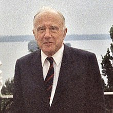

<table class="infobox biography vcard">
<tbody>
<tr>
<th colspan="2">

John Archibald Wheeler

</th>
</tr>
<tr>
<td colspan="2">

Wheeler before the Hermann Weyl-Conference 1985 in Kiel, Germany

</td>
</tr>
<tr>
<th scope="row">Born</th>
<td>July 9, 1911 

<a title="Jacksonville, Florida" href="https://en.wikipedia.org/wiki/Jacksonville,_Florida">Jacksonville, Florida</a>, United States

</td>
</tr>
<tr>
<th scope="row">Died</th>
<td>April 13, 2008&nbsp;(aged&nbsp;96) 

<a title="Hightstown, New Jersey" href="https://en.wikipedia.org/wiki/Hightstown,_New_Jersey">Hightstown, New Jersey</a>, United States

</td>
</tr>
<tr>
<th scope="row">Nationality</th>
<td class="category">American</td>
</tr>
<tr>
<th scope="row">Alma&nbsp;mater</th>
<td><a title="Johns Hopkins University" href="https://en.wikipedia.org/wiki/Johns_Hopkins_University">Johns Hopkins University</a>&nbsp;(Ph.D.)</td>
</tr>
<tr>
<th scope="row">Known&nbsp;for</th>
<td>

<ul>
<li><a title="Breit&ndash;Wheeler process" href="https://en.wikipedia.org/wiki/Breit%E2%80%93Wheeler_process">Breit&ndash;Wheeler process</a></li>
<li><a title="Wheeler&ndash;DeWitt equation" href="https://en.wikipedia.org/wiki/Wheeler%E2%80%93DeWitt_equation">Wheeler&ndash;DeWitt equation</a></li>
<li>Popularizing the term "<a title="Black hole" href="https://en.wikipedia.org/wiki/Black_hole">black hole</a>"</li>
<li><a title="Nuclear fission" href="https://en.wikipedia.org/wiki/Nuclear_fission">Nuclear fission</a></li>
<li><a title="Geometrodynamics" href="https://en.wikipedia.org/wiki/Geometrodynamics">Geometrodynamics</a></li>
<li><a title="General relativity" href="https://en.wikipedia.org/wiki/General_relativity">General relativity</a></li>
<li><a title="Unified field theory" href="https://en.wikipedia.org/wiki/Unified_field_theory">Unified field theory</a></li>
<li><a title="Wheeler&ndash;Feynman absorber theory" href="https://en.wikipedia.org/wiki/Wheeler%E2%80%93Feynman_absorber_theory">Wheeler&ndash;Feynman absorber theory</a></li>
<li><a class="mw-redirect" title="Wheeler's delayed choice experiment" href="https://en.wikipedia.org/wiki/Wheeler%27s_delayed_choice_experiment">Wheeler's delayed choice experiment</a></li>
<li><a title="One-electron universe" href="https://en.wikipedia.org/wiki/One-electron_universe">One-electron universe</a></li>
<li><a title="Geon (physics)" href="https://en.wikipedia.org/wiki/Geon_(physics)">Geon</a></li>
<li><a title="S-matrix" href="https://en.wikipedia.org/wiki/S-matrix">S-matrix</a></li>
<li><a title="Quantum foam" href="https://en.wikipedia.org/wiki/Quantum_foam">Quantum foam</a></li>
<li>Coining the term "<a title="Neutron moderator" href="https://en.wikipedia.org/wiki/Neutron_moderator">neutron moderator</a>"</li>
<li>Coining the term "<a title="Superspace" href="https://en.wikipedia.org/wiki/Superspace">superspace</a>"</li>
<li>Coining the term "<a title="Wormhole" href="https://en.wikipedia.org/wiki/Wormhole">wormhole</a>"</li>
<li><a class="mw-redirect" title="Lorentzian wormhole" href="https://en.wikipedia.org/wiki/Lorentzian_wormhole">Lorentzian wormhole</a></li>
<li>"<a class="mw-redirect" title="It from bit" href="https://en.wikipedia.org/wiki/It_from_bit">It from bit</a>"</li>
<li><a title="Anthropic principle" href="https://en.wikipedia.org/wiki/Anthropic_principle">Participatory anthropic principle</a></li>
</ul>

</td>
</tr>
<tr>
<th scope="row">Spouse(s)</th>
<td>Janette Hegner</td>
</tr>
<tr>
<th scope="row">Awards</th>
<td>

<ul>
<li><a title="Albert Einstein Award" href="https://en.wikipedia.org/wiki/Albert_Einstein_Award">Albert Einstein Award</a>&nbsp;(1965)</li>
<li><a title="Enrico Fermi Award" href="https://en.wikipedia.org/wiki/Enrico_Fermi_Award">Enrico Fermi Award</a>&nbsp;(1968)</li>
<li><a title="Franklin Medal" href="https://en.wikipedia.org/wiki/Franklin_Medal">Franklin Medal</a>&nbsp;(1969)</li>
<li><a title="National Medal of Science" href="https://en.wikipedia.org/wiki/National_Medal_of_Science">National Medal of Science</a>&nbsp;(1970)</li>
<li><a title="Oersted Medal" href="https://en.wikipedia.org/wiki/Oersted_Medal">Oersted Medal</a>&nbsp;(1983)</li>
<li><a title="J. Robert Oppenheimer Memorial Prize" href="https://en.wikipedia.org/wiki/J._Robert_Oppenheimer_Memorial_Prize">J. Robert Oppenheimer Memorial Prize</a>&nbsp;(1984)</li>
<li><a title="Albert Einstein Medal" href="https://en.wikipedia.org/wiki/Albert_Einstein_Medal">Albert Einstein Medal</a>&nbsp;(1988)</li>
<li><a title="Matteucci Medal" href="https://en.wikipedia.org/wiki/Matteucci_Medal">Matteucci Medal</a>&nbsp;(1993)</li>
<li><a title="Wolf Prize in Physics" href="https://en.wikipedia.org/wiki/Wolf_Prize_in_Physics">Wolf Prize in Physics</a>&nbsp;(1997)</li>
<li><a title="Einstein Prize (APS)" href="https://en.wikipedia.org/wiki/Einstein_Prize_(APS)">Einstein Prize (APS)</a>&nbsp;(2003)</li>
</ul>

</td>
</tr>
<tr>
<td colspan="2"><strong>Scientific career</strong></td>
</tr>
<tr>
<th scope="row">Fields</th>
<td class="category"><a title="Physics" href="https://en.wikipedia.org/wiki/Physics">Physics</a></td>
</tr>
<tr>
<th scope="row">Institutions</th>
<td>

<ul>
<li><a title="University of North Carolina at Chapel Hill" href="https://en.wikipedia.org/wiki/University_of_North_Carolina_at_Chapel_Hill">University of North Carolina</a></li>
<li><a title="Princeton University" href="https://en.wikipedia.org/wiki/Princeton_University">Princeton University</a></li>
<li><a title="University of Texas at Austin" href="https://en.wikipedia.org/wiki/University_of_Texas_at_Austin">University of Texas at Austin</a></li>
</ul>

</td>
</tr>
<tr>
<th scope="row"><a title="Thesis" href="https://en.wikipedia.org/wiki/Thesis">Thesis</a></th>
<td><a class="external text" href="https://catalyst.library.jhu.edu/catalog/bib_1628888" rel="nofollow"><em>Theory of the dispersion and absorption of helium</em></a>&nbsp;(1933)</td>
</tr>
<tr>
<th scope="row"><a title="Doctoral advisor" href="https://en.wikipedia.org/wiki/Doctoral_advisor">Doctoral advisor</a></th>
<td><a title="Karl Herzfeld" href="https://en.wikipedia.org/wiki/Karl_Herzfeld">Karl Herzfeld</a></td>
</tr>
<tr>
<th scope="row">Doctoral students</th>
<td>

<ul>
<li><a title="Jacob Bekenstein" href="https://en.wikipedia.org/wiki/Jacob_Bekenstein">Jacob Bekenstein</a></li>
<li><a title="Claudio Bunster" href="https://en.wikipedia.org/wiki/Claudio_Bunster">Claudio Bunster</a></li>
<li><a title="Demetrios Christodoulou" href="https://en.wikipedia.org/wiki/Demetrios_Christodoulou">Demetrios Christodoulou</a></li>
<li><a title="Ignazio Ciufolini" href="https://en.wikipedia.org/wiki/Ignazio_Ciufolini">Ignazio Ciufolini</a></li>
<li><a class="mw-redirect" title="Hugh Everett" href="https://en.wikipedia.org/wiki/Hugh_Everett">Hugh Everett</a></li>
<li><a title="Richard Feynman" href="https://en.wikipedia.org/wiki/Richard_Feynman">Richard Feynman</a></li>
<li><a title="Kenneth W. Ford" href="https://en.wikipedia.org/wiki/Kenneth_W._Ford">Kenneth W. Ford</a></li>
<li><a title="Robert Geroch" href="https://en.wikipedia.org/wiki/Robert_Geroch">Robert Geroch</a></li>
<li><a title="John R. Klauder" href="https://en.wikipedia.org/wiki/John_R._Klauder">John R. Klauder</a></li>
<li><a title="Bahram Mashhoon" href="https://en.wikipedia.org/wiki/Bahram_Mashhoon">Bahram Mashhoon</a></li>
<li><a class="mw-redirect" title="Charles Misner" href="https://en.wikipedia.org/wiki/Charles_Misner">Charles Misner</a></li>
<li><a title="Gilbert Plass" href="https://en.wikipedia.org/wiki/Gilbert_Plass">Gilbert Plass</a></li>
<li><a title="Milton S. Plesset" href="https://en.wikipedia.org/wiki/Milton_S._Plesset">Milton Plesset</a></li>
<li><a title="Gerald Harris Rosen" href="https://en.wikipedia.org/wiki/Gerald_Harris_Rosen">Gerald Harris Rosen</a></li>
<li><a title="Benjamin Schumacher" href="https://en.wikipedia.org/wiki/Benjamin_Schumacher">Benjamin Schumacher</a></li>
<li><a title="Kip Thorne" href="https://en.wikipedia.org/wiki/Kip_Thorne">Kip Thorne</a></li>
<li><a title="Jayme Tiomno" href="https://en.wikipedia.org/wiki/Jayme_Tiomno">Jayme Tiomno</a></li>
<li><a title="John S. Toll" href="https://en.wikipedia.org/wiki/John_S._Toll">John S. Toll</a></li>
<li><a class="mw-redirect" title="Bill Unruh" href="https://en.wikipedia.org/wiki/Bill_Unruh">Bill Unruh</a></li>
<li><a title="Robert Wald" href="https://en.wikipedia.org/wiki/Robert_Wald">Robert Wald</a></li>
<li><a title="Katharine Way" href="https://en.wikipedia.org/wiki/Katharine_Way">Katharine Way</a></li>
<li><a title="Arthur Wightman" href="https://en.wikipedia.org/wiki/Arthur_Wightman">Arthur Wightman</a></li>
</ul>

</td>
</tr>
</tbody>
</table>
 

<strong>John Archibald Wheeler</strong>&nbsp;(July 9, 1911 &ndash; April 13, 2008) was an American&nbsp;<a class="mw-redirect" title="Theoretical physicist" href="https://en.wikipedia.org/wiki/Theoretical_physicist">theoretical physicist</a>. He was largely responsible for reviving interest in&nbsp;<a title="General relativity" href="https://en.wikipedia.org/wiki/General_relativity">general relativity</a>&nbsp;in the United States after World War II. Wheeler also worked with&nbsp;<a title="Niels Bohr" href="https://en.wikipedia.org/wiki/Niels_Bohr">Niels Bohr</a>&nbsp;in explaining the basic principles behind&nbsp;<a title="Nuclear fission" href="https://en.wikipedia.org/wiki/Nuclear_fission">nuclear fission</a>. Together with&nbsp;<a title="Gregory Breit" href="https://en.wikipedia.org/wiki/Gregory_Breit">Gregory Breit</a>, Wheeler developed the concept of the&nbsp;<a title="Breit&ndash;Wheeler process" href="https://en.wikipedia.org/wiki/Breit%E2%80%93Wheeler_process">Breit&ndash;Wheeler process</a>. He is best known for using the term "<a title="Black hole" href="https://en.wikipedia.org/wiki/Black_hole">black hole</a>" for objects with gravitational collapse already predicted during the early 20th century, for inventing the terms "<a title="Quantum foam" href="https://en.wikipedia.org/wiki/Quantum_foam">quantum foam</a>", "<a title="Neutron moderator" href="https://en.wikipedia.org/wiki/Neutron_moderator">neutron moderator</a>", "<a title="Wormhole" href="https://en.wikipedia.org/wiki/Wormhole">wormhole</a>" and "<a class="mw-redirect" title="It from bit" href="https://en.wikipedia.org/wiki/It_from_bit">it from bit</a>", and for hypothesizing the "<a title="One-electron universe" href="https://en.wikipedia.org/wiki/One-electron_universe">one-electron universe</a>".

Wheeler earned his doctorate at&nbsp;<a title="Johns Hopkins University" href="https://en.wikipedia.org/wiki/Johns_Hopkins_University">Johns Hopkins University</a>&nbsp;under the supervision of&nbsp;<a title="Karl Herzfeld" href="https://en.wikipedia.org/wiki/Karl_Herzfeld">Karl Herzfeld</a>, and studied under Breit and Bohr on a&nbsp;<a class="mw-redirect" title="National Research Council (United States)" href="https://en.wikipedia.org/wiki/National_Research_Council_(United_States)">National Research Council</a>&nbsp;fellowship. During 1939 he collaborated with Bohr to write a series of papers using the&nbsp;<a class="mw-redirect" title="Liquid drop model" href="https://en.wikipedia.org/wiki/Liquid_drop_model">liquid drop model</a>&nbsp;to explain the mechanism of fission. During&nbsp;<a title="World War II" href="https://en.wikipedia.org/wiki/World_War_II">World War II</a>, he worked with the&nbsp;<a title="Manhattan Project" href="https://en.wikipedia.org/wiki/Manhattan_Project">Manhattan Project</a>'s&nbsp;<a title="Metallurgical Laboratory" href="https://en.wikipedia.org/wiki/Metallurgical_Laboratory">Metallurgical Laboratory</a>&nbsp;in Chicago, where he helped design&nbsp;<a title="Nuclear reactor" href="https://en.wikipedia.org/wiki/Nuclear_reactor">nuclear reactors</a>, and then at the&nbsp;<a title="Hanford Site" href="https://en.wikipedia.org/wiki/Hanford_Site">Hanford Site</a>&nbsp;in&nbsp;<a title="Richland, Washington" href="https://en.wikipedia.org/wiki/Richland,_Washington">Richland, Washington</a>, where he helped&nbsp;<a title="DuPont" href="https://en.wikipedia.org/wiki/DuPont">DuPont</a>&nbsp;build them. He returned to Princeton after the war ended, but returned to government service to help design and build the&nbsp;<a class="mw-redirect" title="Hydrogen bomb" href="https://en.wikipedia.org/wiki/Hydrogen_bomb">hydrogen bomb</a>&nbsp;in the early 1950s.

For most of his career, Wheeler was a&nbsp;<a title="Princeton University Department of Physics" href="https://en.wikipedia.org/wiki/Princeton_University_Department_of_Physics">professor of physics</a>&nbsp;at&nbsp;<a title="Princeton University" href="https://en.wikipedia.org/wiki/Princeton_University">Princeton University</a>, which he joined in 1938, remaining until his retirement in 1976. At Princeton he supervised 46 PhDs, more than any other professor in the Princeton physics department.

 

<h2> Publications </h2>

<ul>

                             

 <li><a target="_blank" href="https://github.com/manjunath5496/John-Archibald-Wheeler-Publications/blob/master/jawp(1).pdf" style="text-decoration:none;"> Introducing the black hole</a></li>

 <li><a target="_blank" href="https://github.com/manjunath5496/John-Archibald-Wheeler-Publications/blob/master/jawp(2).pdf" style="text-decoration:none;">100 Years of the Quantum</a></li>

<li><a target="_blank" href="https://github.com/manjunath5496/John-Archibald-Wheeler-Publications/blob/master/jawp(3).pdf" style="text-decoration:none;">Iterative Solution Methods for Modeling Multiphase Flow in Porous Media Fully Implicitly</a></li>
 <li><a target="_blank" href="https://github.com/manjunath5496/John-Archibald-Wheeler-Publications/blob/master/jawp(4).pdf" style="text-decoration:none;"> Retro-MACHOs: π in the Sky?</a></li>                              
<li><a target="_blank" href="https://github.com/manjunath5496/John-Archibald-Wheeler-Publications/blob/master/jawp(5).pdf" style="text-decoration:none;">Enhanced velocity mixed finite element methods for flow in multiblock domains</a></li>
<li><a target="_blank" href="https://github.com/manjunath5496/John-Archibald-Wheeler-Publications/blob/master/jawp(6).pdf" style="text-decoration:none;">Quantum anti-centrifugal force</a></li>
 <li><a target="_blank" href="https://github.com/manjunath5496/John-Archibald-Wheeler-Publications/blob/master/jawp(7).pdf" style="text-decoration:none;">Apparent horizons in simplicial Brill wave initial data</a></li>

 <li><a target="_blank" href="https://github.com/manjunath5496/John-Archibald-Wheeler-Publications/blob/master/jawp(8).pdf" style="text-decoration:none;"> Inelastic Scattering of Quanta with Production of Pairs</a></li>
   <li><a target="_blank" href="https://github.com/manjunath5496/John-Archibald-Wheeler-Publications/blob/master/jawp(9).pdf" style="text-decoration:none;">On the Mathematical Description of Light Nuclei by the Method of Resonating Group Structure</a></li>
  
   
 <li><a target="_blank" href="https://github.com/manjunath5496/John-Archibald-Wheeler-Publications/blob/master/jawp(10).pdf" style="text-decoration:none;">Interaction with the absorber as the mechanism of radiation </a></li>                              
<li><a target="_blank" href="https://github.com/manjunath5496/John-Archibald-Wheeler-Publications/blob/master/jawp(11).pdf" style="text-decoration:none;">Classical Electrodynamics in Terms of Direct Interparticle Action </a></li>
</ul>
